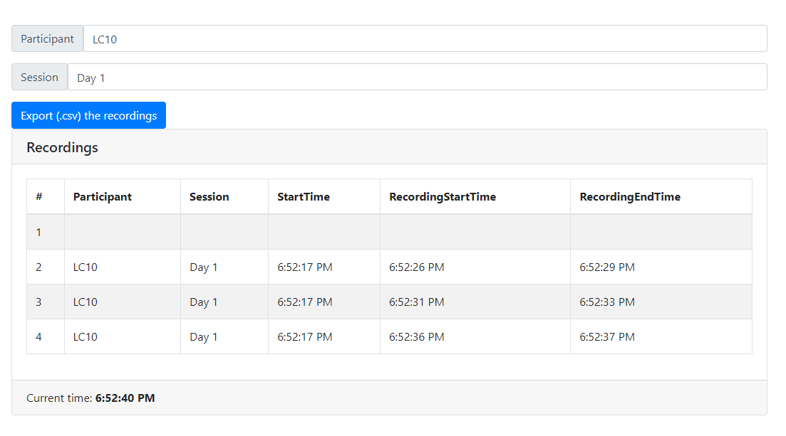
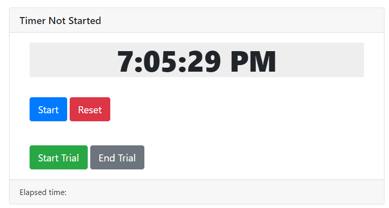

### Installation
- Install [NodeJS](https://nodejs.org/en/download/) and make sure `npm` is available in the command line
- In the project directory, run `npm install`

### Execution
- Everytime you want to record the procedure, run `npm start`
- Open [http://localhost:3000](http://localhost:3000) to view it in your browser.

### Use case
- When starting a video (i.e, a procedure), press the *Start* and keep this button *running...* as long the camera are recordings
- To start recording the trial, press the *Start trial* button, and leave it *running...*
- When a trial is completed, press *End trial* button. 
- When a participant complete a procedure (e.g, end of the video), press *reset* to reinitialize all the counter.

### Exporting
Export the recordings at the end. Before closing or refreshing the browser.

DO NOT REFRESH THE BROWSER DURING THE RECORDINGS

